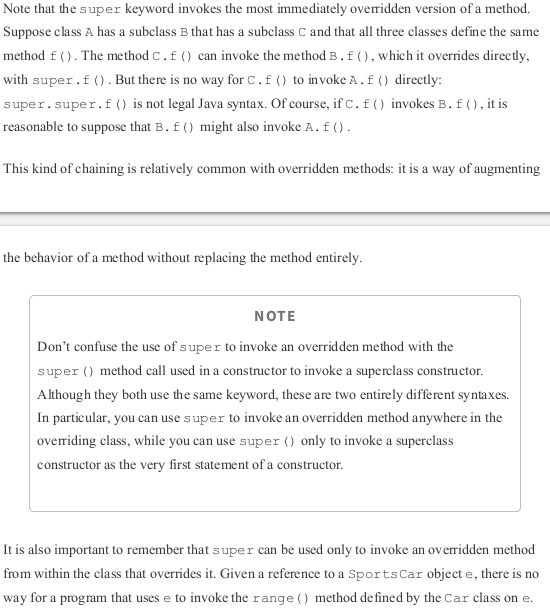
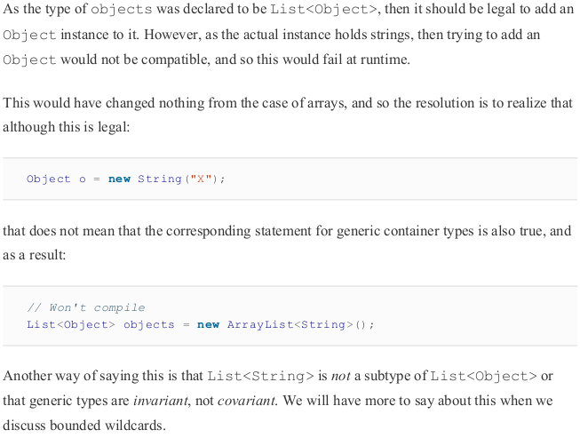

# java_interview_preparation
This is special type of entry in the series, my current girlfriend is learning java, so I will need to remember java so I can help her when the moment of bugs arrive

## Theorical Questions Section

### Theorical Question 1

Do you understand what the javac program is for ?

<b>Answer</b>

Turning java source code (file .java) to java classes. these classes are then turned into bytecode

<b>Source</b>

java in a nutshell, 7th edition

### Theorical Question 2

Do you understand what the javadoc program is for ?

<b>Answer</b>

For extracting comments and create documentation in html files

<b>Source</b>

java in a nutshell, 7th edition

### Theorical Question 3

Do you know what these special words used for ?

abstract
break
finally
implements
interface
this
instanceof
null

<b>Answer</b>

...

<b>Source</b>

java in a nutshell, 7th edition

### Theorical Question 4

Do you know the difference between int, float y double ?

<b>Answer</b>

...

<b>Source</b>

java in a nutshell, 7th edition

### Theorical Question 5

Do you know the outcome of these operations in java ?

7%3

i = 1;
j = ++i;

i = 1;
j = i++;

(byte) 28
(int) (x + 3.14f)
(String)h.get(k)

<b>Answer</b>

...

<b>Source</b>

java in a nutshell, 7th edition

### Theorical Question 5

Do you know the understand what public, private and protected means for variables and functions ?

<b>Answer</b>

...

<b>Source</b>

java in a nutshell, 7th edition

### Theorical Question 6

Do you know what method overloading is ?

<b>Answer</b>

Defining multiple methods with the same name (different behaviours explain this better)

<b>Source</b>

java in a nutshell, 7th edition

### Theorical Question 7

Do you understand what a abstract, final, native, synchronized and static method are ?

<b>Answer</b>

<b>Source</b>

java in a nutshell, 7th edition

### Theorical Question 8

Do you understand the difference between checked and unchecked exceptions ?

<b>Answer</b>

<b>Source</b>

java in a nutshell, 7th edition

### Theorical Question 9

Do you know what the ellipsis (...) mean in the arguments of a method ?

<b>Answer</b>

<b>Source</b>

java in a nutshell, 7th edition

### Theorical Question 9

Do you know what lambda is and how to define it in lambda ?

<b>Answer</b>

<b>Source</b>

java in a nutshell, 7th edition

### Theorical Question 10

If an array called array_! has ten elments, do you understand why are we getting a ArrayIndexOutOfBoundsException message when we try to access array_1[10] ?

<b>Answer</b>

because they are zero indexed (start at 0)

<b>Source</b>

java in a nutshell, 7th edition

### Theorical Question 11

Do you understand what the difference between a deep copy and a shallow copy in java?

<b>Answer</b>

https://howtodoinjava.com/java/array/java-array-clone-shallow-copy/

<b>Source</b>

java in a nutshell, 7th edition

### Theorical Question 12

wrapper classes,,,, boxing and unboxing conversion, ,,,, they explain this better in head first java

<b>Answer</b>

...................................

<b>Source</b>

head first java

### Theorical Question 13

Do you understand what packages are

<b>Answer</b>

<b>Source</b>

head first java

### Theorical Question 15

Do you know how to especify a different classpath ?

<b>Answer</b>

The Java runtime knows where the class files for the standard system classes are located and can load them as needed. When the interpreter runs a program that wants to use a class named com.davidflanagan.examples.Point, it knows that the code for that class is located in a directory named com/davidflanagan/examples/ and, by default, it “looks” in the current directory for a subdirectory of that name. In order to tell the interpreter to look in locations other
than the current directory, you must use the ­classpath option when invoking the interpreter or set the CLASSPATH environment variable.

<b>Source</b>

java in a nutshell, 7th edition

### Theorical Question 16

Do you know what public static void main(String[] args) is for ?

<b>Answer</b>

<b>Source</b>

java in a nutshell, 7th edition

### Theorical Question 17

Can you create java programs outside of classes ?

<b>Answer</b>

Classes are the most fundamental structural element of all Java programs. You cannot write Java code without defining a class. All Java statements appear within classes, and all methods are implemented within classes.

<b>Source</b>

java in a nutshell, 7th edition

### Theorical Question 18

Do you understand what implementing and extending a class means ,,,,,,,,,,,,,,,,,, head first java explain this better ?

<b>Answer</b>

<b>Source</b>

java in a nutshell, 7th edition

### Theorical Question 19

Do you know what transient and volatile variables are ?

<b>Answer</b>

...........................

<b>Source</b>

java in a nutshell, 7th edition

### Theorical Question 20

Do you understand what the super() function is for ?

<b>Answer</b>

<b>Source</b>

java in a nutshell, 7th edition

### Theorical Question 21

Do you understand what overriding a superclass means ?

<b>Answer</b>

<b>Source</b>

java in a nutshell, 7th edition

### Theorical Question 22

Do you understand what data hiding through encapsulation means ?

<b>Answer</b>

One of the most important object­oriented techniques we haven’t discussed so far is hiding the data within the class and making it available only through the methods.

If a member of a class is declared with the public modifier, it means that the member is
accessible anywhere the containing class is accessible. This is the least restrictive type of
access control.

If a member of a class is declared private, the member is never accessible, except within
the class itself. This is the most restrictive type of access control.

If a member of a class is declared protected, it is accessible to all classes within the
package (the same as the default package accessibility) and also accessible within the body
of any subclass of the class, regardless of the package in which that subclass is defined.

If a member of a class is not declared with any of these modifiers, it has default access
(sometimes called package access) and it is accessible to code within all classes that are
defined in the same package but inaccessible outside of the package.

<b>Source</b>

java in a nutshell, 7th edition

### Theorical Question 23

Do you understand why interfaces were created in java ?

<b>Answer</b>

We also saw that a Java class can only inherit from a single class. This is quite a big restriction on the kinds of object­oriented programs that we want to build. The designers of Java knew this, but they also wanted to ensure that Java’s approach to object­oriented programming was less complex and error­prone than, for example, that of C++.

The solution that they chose was to introduce the concept of an interface to Java. Like a class, an interface defines a new reference type. As its name implies, an interface is intended to represent only an API—so it provides a description of a type, and the methods (and signatures) that classes that implement that API must provide.

In general, a Java interface does not provide any implementation code for the methods that it
describes. These methods are considered mandatory—any class that wishes to implement the
interface must provide an implementation of these methods.

<b>Source</b>

java in a nutshell, 7th edition

### Theorical Question 24

Do you understand what are default methods in interface ?

<b>Answer</b>

Adding new methods to an interface without breaking backward compatibility requires
providing some implementation for the older implementations of the interface so that they can
continue to work. This mechanism is a default method, and it was first added to the platform
in JDK 8.

<b>Source</b>

java in a nutshell, 7th edition

### Theorical Question 25

Do you know what generics are in java ?

<b>Answer</b>

One of the great strengths of the Java platform is the standard library that it ships. It provides a great deal of useful functionality—and in particular robust implementations of common datastructures. These implementations are relatively simple to develop with and are well documented. The libraries are known as the Java Collections. 

Although they were still very useful, the earliest versions of the collections had a fairly major limitation, however. This limitation was that the data structure (sometimes called the container) essentially obscured the type of the data being stored in it.

<b>Source</b>

java in a nutshell, 7th edition

### Theorical Question 26

Do you know what wildcard types are in java ?

<b>Answer</b>

<b>Source</b>

java in a nutshell, 7th edition

### Theorical Question 27

Do you know what enums are in java ?

<b>Answer</b>

<b>Source</b>

java in a nutshell, 7th edition

### Theorical Question 28

Do you know what lambda expressions are in java ?

<b>Answer</b>

<b>Source</b>

java in a nutshell, 7th edition

### Theorical Question 29

Do you know what functional-like functions are given to you in java ?

<b>Answer</b>

<b>Source</b>

java in a nutshell, 7th edition

